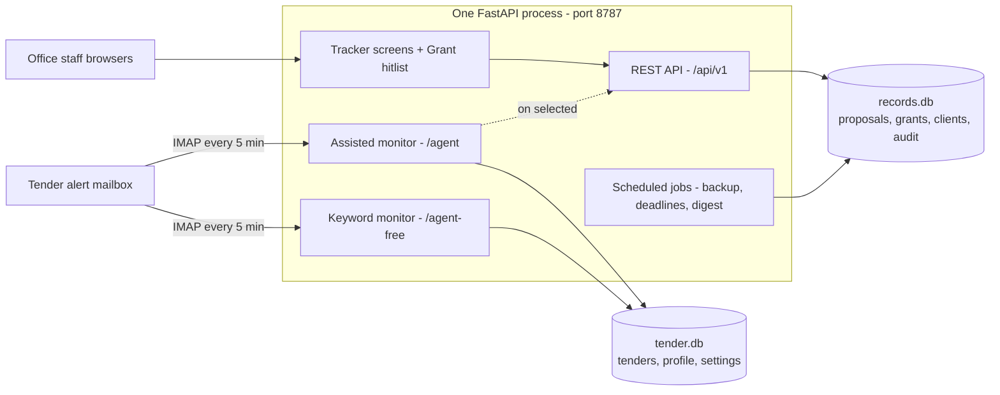
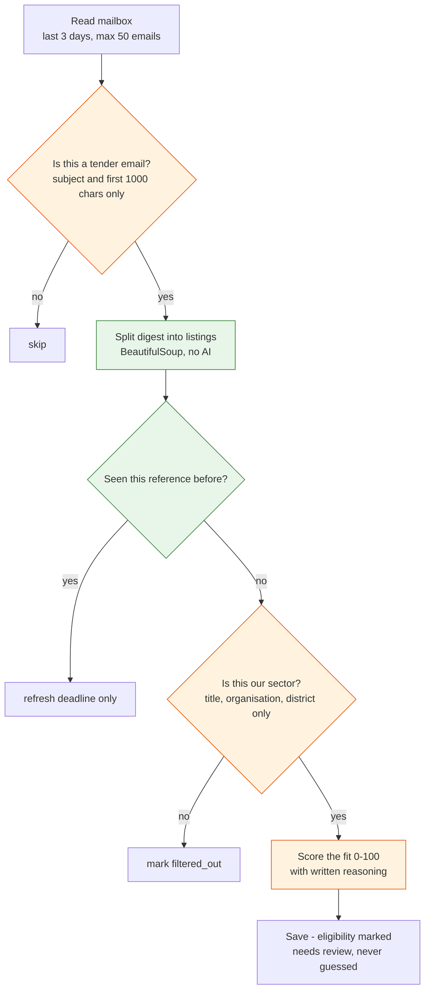

# Bhumijo — Proposal & Tender Management System

A self-hosted system that keeps a consultancy's proposal and grant records, and automatically finds relevant public tenders in a mailbox that receives roughly **1,000 listings a month** — of which about **20** are worth a human's time.

Built for [Bhumijo Limited](https://bhumijopd.com), a Bangladeshi WASH, urban planning and facility management company. Runs on one office machine, no vendor, no licence fees, no data leaving the building.


---

## The problem

Two jobs, both done by hand, both leaking value:

| | Before | After |
|---|---|---|
| **Proposal records** | Spread across files. No authoritative version. Two people editing at once meant one person's work was silently overwritten. No history. | One register with 182 proposals, 193 grant programmes and 47 clients. Concurrent-safe writes. Every change recorded with its old and new value. |
| **Tender screening** | ~1,000 email listings a month read by hand. A missed deadline is an opportunity lost outright. | Automated screening every 5 minutes, ranked by closing date, with the reasoning for every pick shown. |

---

## Architecture

Four components in a single FastAPI process, two deliberately separate SQLite databases.



The two databases never join. The only traffic between them is an HTTP call when a tender is marked for pursuit and becomes a proposal — so the tender side can be reset or rebuilt at any time with zero risk to the company's records.

---

## The tender pipeline

The core of the system, and where its design decisions live.



Orange = paid model call &nbsp;·&nbsp; Green = plain code, free

---

## Design decisions worth explaining

**Only pay for judgement.** A tender digest has identical structure every day, so extracting its fields is a regex job, not an AI job — at ~1,000 listings a month, an AI call per listing would have dominated the entire budget for no accuracy gain. Deduplication sits *before* the first paid call, because the same tender re-lists daily until it closes; without it the cost multiplies by however many days each tender stays open. The funnel narrows before the money is spent, not after.

**Two model tiers, chosen by volume.** The two highest-frequency calls use the cheapest model; the two that require real reasoning use a stronger one, on a far smaller number of items. Model names never appear outside `config.py` — the code speaks in "cheap" and "capable" tiers.

**Relevance screening is a model call, not a keyword list.** A real listing from Bangladesh Police reads *"Request for Expression of Interest for Selection of Consultant / Consulting Firm"* — no sector keyword anywhere, and a genuine opportunity. The prompt is deliberately biased toward `true` when uncertain: a false positive costs a fraction of a taka at the next stage, a false negative is a tender missed with no way of ever knowing.

**`None` is a load-bearing state.** `hard_filter_pass` is nullable, and null means *"needs review"* — not *"not processed"*. Digest listings never contain eligibility conditions; those live behind the notice link. Treating absent eligibility as failure would render every automated tender as rejected and leave the dashboard permanently empty. Only the full-notice path, which has real eligibility text to reason over, ever writes `true` or `false`.

**A free fallback that isn't a downgrade path.** `/agent-free` does the same job with a maintained keyword list instead of a model — so tender monitoring never stops because a subscription lapsed. It also works as a control: when the two disagree, that's signal; when both find nothing, the problem is upstream of both. Every record it writes carries its own limitation in text: *"Not checked — keyword matching cannot read eligibility rules."*

**Strict layering, enforced by a test.** `api → services → repositories → database`, each layer calling only the one below. A route never writes SQL; a business rule never knows it's being called over HTTP. `test_architecture.py` fails the build if that's violated. This is what made the concurrent-write bug a one-file fix.

**Failure isolation with a free retry.** Each listing is processed in its own try/except so one malformed entry can't cost the other 23. But if *any* listing in an email failed, the whole email is left unmarked — because reference-based dedup makes reprocessing nearly free, so the next run retries just the failures instead of losing them silently.

**Silence is ambiguous, so it's designed out.** A status email is sent after *every* scheduled run — including "nothing found". If mail only arrived when there was news, silence would mean either "quiet week" or "the process died", and you couldn't tell which. Sending every time makes a *missing* email the alarm.

---

## Stack

| Layer | Choice |
|---|---|
| Web framework | FastAPI + Uvicorn |
| Database | SQLite — raw SQL in the tracker's repository layer, SQLAlchemy in the agent modules |
| Migrations | Numbered `.sql` files (tracker), Alembic (agents) |
| Scheduling | APScheduler for the monitors, a plain thread for nightly jobs |
| Email | `imaplib` / `smtplib` (stdlib) |
| Parsing | BeautifulSoup, `pypdf` |
| Frontend | Vanilla JS + Chart.js for the tracker; Jinja2 server-rendered for the agents |
| Tests | pytest — 7 suites |

Two intentionally different styles in one codebase: the agent modules began as a standalone project and were merged in as a mounted package rather than rewritten.

---

## Layout

```
backend/            the tracker
  api/              routes only — no rules, no SQL
  services/         every business rule
  database/         schema, migrations, the only SQL in the system
  security/         tokens, sessions, permissions, audit trail
  jobs/             backup · deadline alerts · weekly digest
  tests/            7 suites
app/                assisted tender monitor, mounted at /agent
  services/ai.py    every model call, in one file
  services/pipeline.py
  services/digest_parse.py   shared by both monitors
agent_free/         keyword tender monitor, mounted at /agent-free
  keywords.py       the whole of its judgement
frontend/           shell + dashboard · proposals · clients · reports
```

---

## Running it

```bash
pip install -r requirements.txt
cp .env.example .env          # then fill in the values
python -m backend.migrate     # first run only
python -m backend.main
```

Open `http://localhost:8787`. API docs at `/docs`.

The assisted monitor needs `ANTHROPIC_API_KEY`; without it `/agent-free` still runs and finds tenders. Mail intake needs `IMAP_APP_PASSWORD`.

```bash
pytest backend/tests -q       # run the tests
```

---

## Security

Nothing sensitive is in the code or either database — all credentials live in one `.env` read once at startup. Only the `frontend` directory is served; there is no catch-all handler, and a test asserts that the token file, the databases and the source files all return 404. Deletion is restricted to the server machine itself.

**This repository contains no data.** Databases, logs, backups, tokens and `.env` are excluded by `.gitignore`. The proposal and client figures quoted above describe the production deployment, not anything committed here.

---

## Known limitations

Written down rather than discovered later:

- Access is one shared token. The role structure (5 roles, 14 permissions) is built but named accounts aren't provisioned, so the audit log records *what* changed, not *who*.
- The keyword monitor matches English whole-words, so `"Public Toilets"` doesn't match `toilet` — plurals must be added to the list explicitly. Bengali is matched as substring (the script has no usable word boundaries), which over-matches in the opposite direction.
- Deadline reminders compute correctly and log, but don't send — the sending mailbox is undecided.
- The grant hitlist is still a single 151 KB HTML file; the tracker was split into a shell plus four screens, the hitlist wasn't.
- Runs on one workstation. A Dockerfile and a NAS deployment procedure exist but haven't been executed.

---

<!--
  BEFORE SHARING THIS REPO:
  Add 2–3 screenshots — they do more than any paragraph here.
  Put them in docs/screenshots/ and insert above the "Architecture" section:

  ## Screens
  
  

  Crop or blur any real client names before committing.
-->

**Author** — Aishik Barua · [github.com/AishikBarua](https://github.com/AishikBarua)
